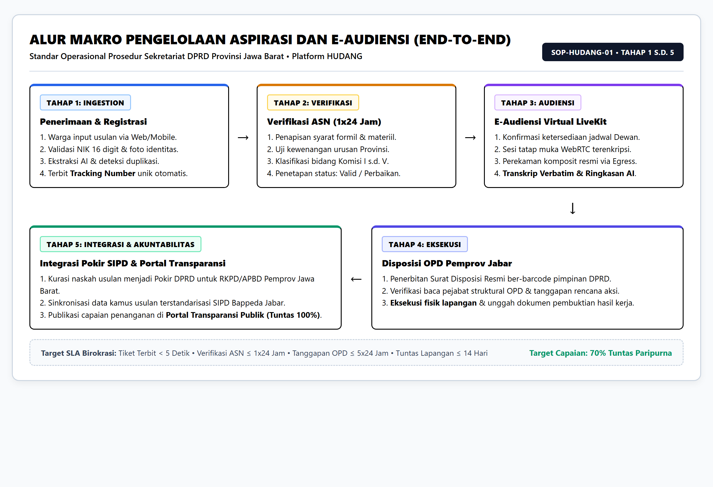
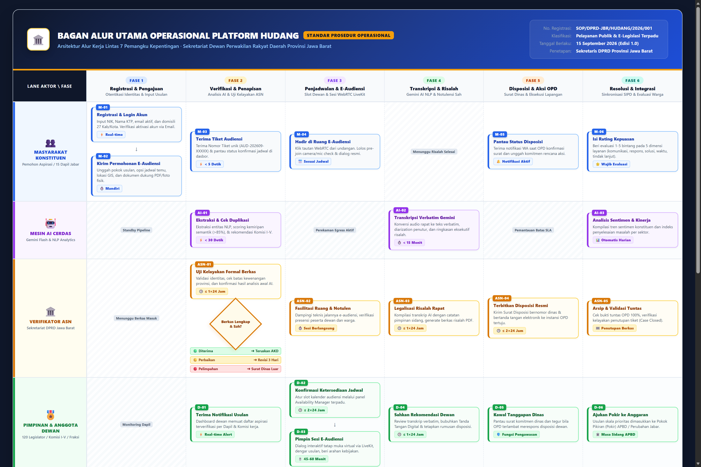
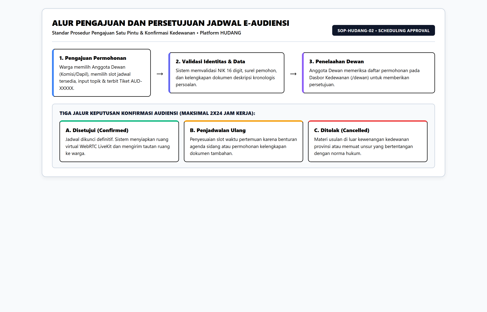
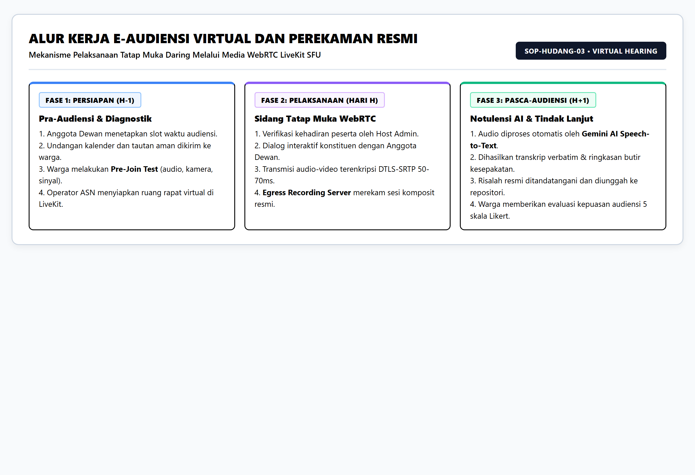
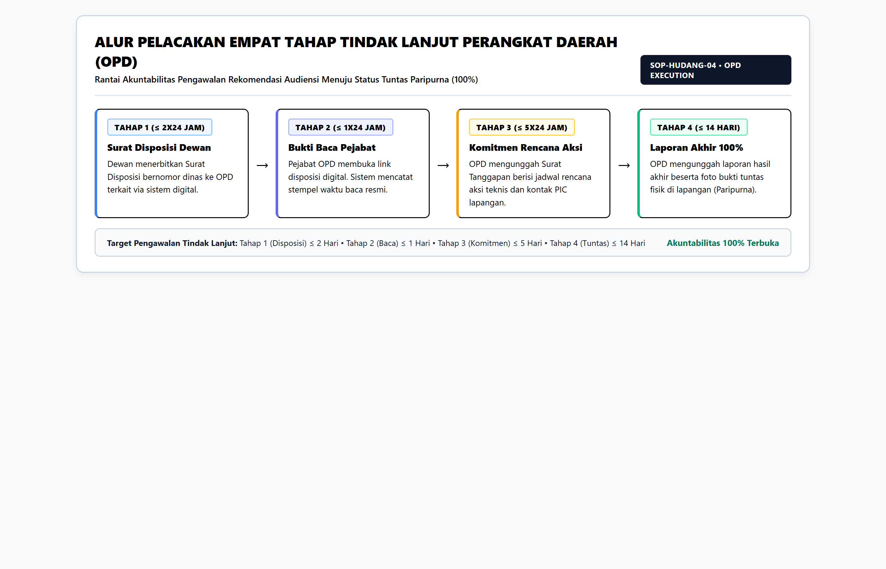

# STANDAR OPERASIONAL PROSEDUR (SOP)

## PENYELENGGARAAN E-AUDIENSI DAN PENGAWALAN ASPIRASI BERBASIS PLATFORM HUDANG

### SEKRETARIAT DEWAN PERWAKILAN RAKYAT DAERAH PROVINSI JAWA BARAT

---

## 1. DOKUMEN KONTROL DAN IDENTITAS FORMAL

| Parameter Dokumen | Spesifikasi dan Penetapan Formal |
| :--- | :--- |
| Judul Dokumen | Standar Operasional Prosedur Penyelenggaraan E-Audiensi dan Pengawalan Tindak Lanjut Aspirasi Berbasis Platform HUDANG |
| Kode Klasifikasi / Nomor Registrasi | SOP/DPRD-JBR/HUDANG/2026/001 |
| Tanggal Efektif Mulai Berlaku | 15 September 2026 |
| Status Revisi / Edisi | Edisi 2.0 (Revisi Praktis Terpadu – Selaras Alur Sistem Aplikasi) |
| Unit Organisasi Pemilik Proses | Sekretariat Dewan Perwakilan Rakyat Daerah Provinsi Jawa Barat |
| Unit Pelaksana Teknis Harian | Bagian Persidangan dan Perundang-undangan serta Bagian Fasilitasi Penganggaran dan Pengawasan |
| Unit Pendukung Operasional TIK | Subbagian Humas, Protokol, dan Publikasi bersama Tim Pengelola SPBE Diskominfo Jabar |
| Pejabat Pembuat Dokumen | Reformer Proyek Perubahan (Dr. H. Dodi Sukmayana, SE., MM.) bersama Tim Efektif Transformasi Digital |
| Pejabat Penetap Dokumen | Sekretaris Dewan Perwakilan Rakyat Daerah Provinsi Jawa Barat |
| Tanggal Evaluasi dan Peninjauan Ulang | 15 September 2027 (Berkala Tahunan) |
| Landasan Yuridis Operasional | 1. Undang-Undang Republik Indonesia Nomor 23 Tahun 2014 tentang Pemerintahan Daerah. 2. Undang-Undang Republik Indonesia Nomor 27 Tahun 2022 tentang Pelindungan Data Pribadi (UU PDP). 3. Peraturan Presiden Republik Indonesia Nomor 95 Tahun 2018 tentang Sistem Pemerintahan Berbasis Elektronik (SPBE). 4. Peraturan Menteri Pendayagunaan Aparatur Negara dan Reformasi Birokrasi Nomor 35 Tahun 2012 tentang Pedoman Penyusunan Standar Operasional Prosedur Administrasi Pemerintahan. 5. Peraturan Daerah Provinsi Jawa Barat tentang Penyelenggaraan Pelayanan Publik dan Keterbukaan Informasi. 6. Peraturan Tata Tertib DPRD Provinsi Jawa Barat Nomor 1 Tahun 2022. 7. Keputusan Pimpinan DPRD Provinsi Jawa Barat tentang Tata Kelola Digitalisasi Pelayanan Audiensi Publik Platform HUDANG. |
| Sasaran Pemakai Layanan | 1. Warga Masyarakat / Konstituen / Delegasi Komunitas pada 15 Daerah Pemilihan (Dapil) se-Jawa Barat. 2. Pimpinan dan Anggota DPRD Provinsi Jawa Barat (120 Anggota, Fraksi, dan Komisi I s.d. V). 3. Tim Administrator & Fasilitator Sidang Sekretariat DPRD Jawa Barat. 4. Pejabat Penghubung dan Kepala Perangkat Daerah Teknis (Organisasi Perangkat Daerah / OPD) Pemprov Jabar. 5. Tim Perekayasa TIK Diskominfo Provinsi Jawa Barat. |

> [!NOTE]
> Standar Operasional Prosedur (SOP) ini mengikat secara hukum seluruh aparatur sipil negara, pimpinan dan anggota kedewanan, serta pejabat perangkat daerah di lingkungan Pemerintah Daerah Provinsi Jawa Barat dalam penyelenggaraan penyerapan aspirasi publik dan musyawarah daring.

---

## 2. DASAR PEMIKIRAN, ASAS PELAYANAN, TUJUAN, DAN RUANG LINGKUP

### 2.1 Dasar Pemikiran Operasional

Provinsi Jawa Barat memiliki bentang wilayah seluas 37.087,92 kilometer persegi dengan 18 Kabupaten dan 9 Kota serta total populasi melampaui 51,7 juta jiwa yang terdistribusi ke dalam 15 Daerah Pemilihan. Berdasarkan evaluasi empiris tata laksana audiensi manual di lingkungan Sekretariat DPRD Provinsi Jawa Barat, pelaksanaan tatap muka fisik di Gedung DPRD Kota Bandung sering terkendala jarak geografis pelosok, benturan agenda reses dewan, serta keterbatasan kapasitas ruang rapat fisik.

Kehadiran Platform HUDANG (Hadirkan Usulan, Dengar Aspirasi, Nyata untuk Gerak rakyat) mengintegrasikan seluruh proses pelayanan ke dalam satu pintu layanan terpadu berbasis digital: **Permohonan E-Audiensi (Tatap Muka Virtual Langsung)**. Melalui platform ini, masyarakat dapat memilih Anggota Dewan yang dituju, menentukan slot jadwal yang tersedia, berdialog langsung via video conference WebRTC terenkripsi, memperoleh risalah rapat otomatis berbasis kecerdasan buatan (AI), serta mengawal 4 tahap tindak lanjut oleh Perangkat Daerah (OPD) teknis secara transparan hingga tuntas 100%.

### 2.2 Asas-Asas Penyelenggaraan Pelayanan Publik

Penyelenggaraan pelayanan E-Audiensi berpedoman pada asas-asas utama administrasi pemerintahan:

1. **Asas Kepastian Hukum**: Menjamin bahwa seluruh rangkaian audiensi, penerbitan risalah, disposisi dewan, hingga tindak lanjut eksekutif memiliki legalitas formal sesuai peraturan perundang-undangan.

2. **Asas Keterbukaan**: Menjamin masyarakat pemohon dapat memantau status perkembangan permohonan dan progres disposisi OPD secara langsung melalui Nomor Registrasi Tiket tanpa hambatan birokrasi.

3. **Asas Kecepatan dan Kemudahan**: Memanfaatkan teknologi digital untuk menyederhanakan alur birokrasi, mengeliminasi jarak tempuh fisik, dan mempercepat respons kedewanan.

4. **Asas Akuntabilitas**: Mewajibkan seluruh pihak—baik Anggota Dewan, aparatur sekretariat, maupun dinas teknis (OPD)—mempertanggungjawabkan setiap tindakan dengan bukti administratif dan dokumentasi lapangan yang sah.

5. **Asas Partisipatif**: Membuka kesempatan setara bagi seluruh lapisan masyarakat dari 27 Kabupaten/Kota se-Jawa Barat untuk menyampaikan aspirasi pembangunan secara bermartabat dan terstruktur.

### 2.3 Tujuan Standar Operasional Prosedur

1. Memberikan panduan kerja yang lugas, terstandarisasi, dan mudah dipahami bagi seluruh pihak dalam penyelenggaraan E-Audiensi berbasis Platform HUDANG.

2. Menjamin transparansi status permohonan warga melalui penerbitan Nomor Registrasi Tiket Digital yang dapat dipantau setiap saat.

3. Memfasilitasi tatap muka virtual resmi antara Konstituen dengan 120 Anggota DPRD Jawa Barat melalui media video conference yang aman, berkualitas tinggi, dan terdokumentasi resmi.

4. Menjamin akuntabilitas tindak lanjut rekomendasi audiensi melalui pengawalan empat tahap berurutan oleh Organisasi Perangkat Daerah (OPD) Pemprov Jawa Barat hingga tuntas 100%.

5. Mengukur indeks kinerja pelayanan kedewanan secara objektif melalui instrumen evaluasi kepuasan konstituen multi-dimensi pasca-audiensi.

### 2.4 Batasan Ruang Lingkup Layanan

SOP ini mengatur alur operasional satu pintu layanan Platform HUDANG yang mencakup:

1. Registrasi mandiri akun warga, validasi identitas berbasis NIK 16 digit, dan aktivasi akun melalui konfirmasi surel (email).

2. Pengajuan permohonan E-Audiensi (pemilihan Anggota Dewan/Komisi/Dapil, pemilihan slot jadwal yang tersedia, dan pengisian pokok usulan beserta berkas bukti).

3. Penelaahan dan konfirmasi persetujuan jadwal audiensi oleh Anggota Dewan bersangkutan didukung fasilitator Sekretariat DPRD.

4. Penyelenggaraan forum musyawarah tatap muka virtual (E-Audiensi) berbasis teknologi WebRTC LiveKit SFU.

5. Perekaman sesi resmi, transkripsi teks otomatis, dan penyusunan ringkasan eksekutif risalah persidangan berbantuan Google Gemini AI.

6. Pengawalan empat tahap tindak lanjut hasil audiensi oleh Perangkat Daerah (OPD) Pemprov Jabar (Disposisi Resmi, Bukti Baca OPD, Tanggapan & Komitmen OPD, serta Laporan Hasil Lapangan 100%).

7. Penilaian indeks kepuasan konstituen (Rating System) dan pemutakhiran data capaian keterbukaan informasi pada Portal Transparansi Publik.

---

## 3. DEFINISI OPERASIONAL DAN GLOSARIUM ISTILAH BAKU

1. **Platform HUDANG**: Sistem informasi resmi berbasis web dan mobile yang dikembangkan oleh Sekretariat DPRD Provinsi Jawa Barat untuk memfasilitasi musyawarah E-Audiensi tatap muka virtual dan pengawalan tindak lanjut aspirasi pembangunan daerah.

2. **Masyarakat / Konstituen**: Setiap warga negara atau delegasi lembaga/komunitas yang memiliki identitas kependudukan sah (NIK) dan bertempat tinggal di wilayah Provinsi Jawa Barat (15 Daerah Pemilihan).

3. **E-Audiensi**: Forum musyawarah tatap muka virtual resmi antara Konstituen dengan Anggota DPRD Provinsi Jawa Barat yang difasilitasi melalui media video conference interaktif terenkripsi.

4. **Nomor Registrasi Tiket**: Kode alfanumerik unik yang diterbitkan otomatis oleh sistem saat permohonan audiensi berhasil dikirimkan (contoh: `AUD-202609-00125`), berfungsi sebagai identitas pelacakan terpadu.

5. **Availability Manager (Manajer Jadwal)**: Modul kalender ketersediaan waktu kerja kedewanan di mana Anggota Dewan menyediakan slot jam pertemuan daring yang dapat dipilih oleh masyarakat.

6. **LiveKit SFU (Selective Forwarding Unit)**: Infrastruktur server gateway transmisi media audio-video berbasis WebRTC yang menyediakan panggilan tatap muka berlatensi rendah, adaptif terhadap kondisi jaringan, dan aman.

7. **Transkrip & Ringkasan Gemini AI**: Notulensi dan ringkasan eksekutif pokok pembicaraan yang diproses secara otomatis dari rekaman audio pertemuan menggunakan kecerdasan buatan Google Gemini AI.

8. **Empat Tahap Tindak Lanjut (Follow-Up Tracker)**: Mekanisme pengawalan rekomendasi audiensi yang terbagi dalam 4 fase akuntabilitas: Disposisi Resmi Dewan, Bukti Baca Pejabat OPD, Surat Tanggapan Komitmen OPD, serta Laporan Hasil Akhir Lapangan 100% Tuntas.

9. **Organisasi Perangkat Daerah (OPD)**: Dinas, badan, atau biro di lingkungan Pemerintah Daerah Provinsi Jawa Barat yang menerima disposisi rekomendasi dewan untuk mengeksekusi penanganan teknis di lapangan.

10. **Portal Transparansi Publik**: Laman keterbukaan informasi publik yang menampilkan rekapitulasi statistik jadwal audiensi, progres penyelesaian tindak lanjut OPD, dan indeks kepuasan konstituen tanpa memerlukan login akun.

---

## 4. MATRIKS PERAN DAN TANGGUNG JAWAB (RACI MATRIX)

Prinsip pembagian peran mengacu pada standar tata kelola RACI (*Responsible, Accountable, Consulted, Informed*):

| No | Rincian Aktivitas Operasional | Masyarakat | Anggota Dewan | Fasilitator / Admin Sekretariat | Pejabat OPD | Tim Perekayasa TIK |
| :--- | :--- | :--- | :--- | :--- | :--- | :--- |
| 1 | Pendaftaran Akun Warga & Validasi NIK | R, A | I | I | - | C, I |
| 2 | Pengajuan Permohonan E-Audiensi (Pilih Dewan & Jadwal) | R, A | I | I | - | I |
| 3 | Penelaahan Berkas & Konfirmasi Persetujuan Jadwal | I | R, A | C, R | - | I |
| 4 | Pelaksanaan Musyawarah Virtual (E-Audiensi LiveKit) | R | R, A | C, R | C | C |
| 5 | Perekaman Sesi, Transkripsi AI & Notulensi Risalah | I | A | R | - | R, A |
| 6 | Tahap 1 Follow-Up: Penerbitan Surat Disposisi Dewan | I | R, A | R | I | - |
| 7 | Tahap 2 Follow-Up: Konfirmasi Baca Pejabat OPD | I | I | I | R, A | - |
| 8 | Tahap 3 Follow-Up: Unggah Tanggapan & Komitmen OPD | I | I | C | R, A | - |
| 9 | Tahap 4 Follow-Up: Eksekusi Lapangan & Bukti 100% | I | I | C | R, A | - |
| 10 | Pengisian Evaluasi Kepuasan Dewan (Rating 5 Bintang) | R, A | I | I | - | I |
| 11 | Pemutakhiran Portal Transparansi Publik | I | I | R | I | R, A |

---

## 5. BAGAN ALUR PROSEDUR UTAMA DAN DIAGRAM DETAIL (FLOWCHART)

### 5.1 Bagan Alur Makro dan Peta Utama Pelayanan Platform HUDANG

Bagan alur berikut ini menggambarkan alur kerja komprehensif dari pendaftaran akun pemohon, pengajuan audiensi satu pintu, konfirmasi jadwal kedewanan, tatap muka virtual LiveKit, transkripsi cerdas Gemini AI, hingga pengawalan 4 tahap tindak lanjut OPD dan penilaian kinerja.

---

### 5.2 Bagan Alur Pengajuan dan Persetujuan Jadwal E-Audiensi

Bagan alur berikut memperlihatkan mekanisme pengajuan permohonan audiensi oleh warga, validasi integritas data, serta pengambilan keputusan konfirmasi persetujuan jadwal oleh Anggota Dewan.

---

### 5.3 Bagan Alur Pelaksanaan Sesi E-Audiensi Virtual dan Transkripsi AI

Bagan alur berikut memvisualisasikan koneksi media WebRTC LiveKit SFU, pengujian kesiapan perangkat (Pre-Join Screen), perekaman resmi persidangan, serta konversi rekaman audio menjadi transkrip dan ringkasan eksekutif risalah oleh Google Gemini AI.

---

### 5.4 Bagan Alur Pelacakan Empat Tahap Tindak Lanjut Perangkat Daerah (OPD)

Bagan alur berikut mengilustrasikan pembuktian akuntabilitas pasca-audiensi mulai dari penerbitan surat disposisi dewan bernomor resmi, pencatatan stempel waktu baca OPD, unggahan surat komitmen rencana aksi, sampai unggahan bukti foto dokumentasi penyelesaian fisik 100% di lapangan.

---

## 6. URAIAN OPERASIONAL LANGKAH KERJA SECARA RINCI

### 6.1 Prosedur Pendaftaran Akun dan Akses Masuk Warga

1. **Pelaksana**: Warga Masyarakat / Konstituen Pemohon didukung sistem otentikasi otomatis.
2. **Kelengkapan Masukan**: Nama Lembaga/Komunitas/Individu, Kategori Instansi, Nama PIC, Nomor Induk Kependudukan (NIK 16 digit), Nomor WhatsApp aktif, Alamat Surat Elektronik (Surel/Email) aktif, Kata Sandi, serta Wilayah Domisili (Kabupaten/Kota dan Kecamatan di Jawa Barat).
3. **Uraian Prosedur**:
   - Warga mengakses Portal Web Platform HUDANG atau aplikasi seluler, kemudian memilih menu **Daftar Akun Baru**.
   - Warga melengkapi formulir pendaftaran dengan memasukkan identitas diri secara benar dan lengkap.
   - Sistem melakukan verifikasi format data dan langsung mengaktifkan akun pengguna. Konfirmasi aktivasi dan informasi kredensial dikirimkan secara otomatis ke alamat surel (email) pemohon.
   - Warga langsung dapat masuk (*login*) ke portal menggunakan alamat surel dan kata sandi yang telah didaftarkan.
4. **Waktu Standar**: Kurang dari 2 menit.
5. **Keluaran**: Akun Pengguna Warga Aktif dan Hak Akses Dasbor Masyarakat.

### 6.2 Prosedur Pengajuan Permohonan E-Audiensi (Satu Pintu Layanan)

1. **Pelaksana**: Warga Konstituen Terdaftar.
2. **Kelengkapan Masukan**: Pilihan Anggota Dewan yang dituju, pilihan tanggal dan slot jam ketersediaan audiensi, judul usulan topik, deskripsi kronologi permasalahan, dan lampiran berkas bukti (foto JPG/PNG maksimal 5 MB atau dokumen PDF maksimal 10 MB).
3. **Uraian Prosedur**:
   - Setelah masuk ke beranda dasbor, pemohon memilih menu **Ajukan Permohonan**.
   - Pemohon menelusuri daftar Anggota DPRD Provinsi Jawa Barat yang dapat difilter secara praktis berdasarkan Komisi (Komisi I s.d. V) atau Daerah Pemilihan (Dapil 1 s.d. 15).
   - Pemohon memilih Anggota Dewan yang dituju dan memilih slot jadwal pertemuan yang tersedia pada kalender ketersediaan dewan.
   - Pemohon mengisi judul pokok permasalahan, uraian singkat aspirasi/kronologi persoalan di lapangan, serta mengunggah berkas bukti pendukung.
   - Pemohon menekan tombol **Kirim Permohonan**.
   - Sistem secara instan menerbitkan Nomor Registrasi Tiket Audiensi unik (format: `AUD-YYYYMM-XXXXX`) dan mencatat status permohonan sebagai **Menunggu Konfirmasi (Pending)**.
4. **Waktu Standar**: Kurang dari 5 menit.
5. **Keluaran**: Nomor Registrasi Tiket Audiensi Digital dan Berkas Permohonan Terjadwal di Sistem.

### 6.3 Prosedur Penelaahan dan Konfirmasi Jadwal oleh Anggota Dewan

1. **Pelaksana**: Anggota DPRD bersangkutan didukung Staf Fasilitator Sidang Sekretariat DPRD.
2. **Kelengkapan Masukan**: Daftar permohonan audiensi masuk pada Dasbor Kedewanan dan berkas lampiran warga.
3. **Uraian Prosedur**:
   - Anggota Dewan membuka Dasbor Kedewanan (`/dewan`) untuk meninjau daftar permohonan audiensi yang masuk pada status *Pending*.
   - Anggota Dewan memeriksa relevansi materi usulan dan kesesuaian waktu pertemuan.
   - Anggota Dewan menentukan status permohonan:
     - **Setujui (Confirmed)**: Slot jadwal dikunci secara definitif, sistem menyiapkan ruang virtual LiveKit, dan undangan pertemuan diterbitkan ke akun pemohon.
     - **Tolak / Batalkan (Cancelled)**: Dilakukan apabila materi usulan bertentangan dengan hukum, memuat fitnah/SARA, atau di luar kewenangan kedewanan, disertai catatan alasan penolakan yang jelas.
   - Fasilitator Sidang pada Dasbor Admin (`/admin`) memantau seluruh jadwal yang terkonfirmasi untuk memastikan kesiapan infrastruktur konferensi video.
4. **Waktu Standar**: Maksimal 2 kali 24 jam kerja sejak permohonan diajukan.
5. **Keluaran**: Status Jadwal Terkonfirmasi (*Confirmed*) dan Tautan Akses Ruang Audiensi Digital.

### 6.4 Prosedur Pelaksanaan Musyawarah Virtual (E-Audiensi)

1. **Pelaksana**: Anggota Dewan (Pimpinan Sidang), Warga Konstituen Pemohon, dan Fasilitator Sidang Sekretariat.
2. **Kelengkapan Masukan**: Ruang virtual aktif WebRTC LiveKit, gawai berkamera dan ber-mikrofon, materi paparan warga, serta tata tertib musyawarah kedewanan.
3. **Uraian Prosedur**:
   - Menjelang waktu pelaksanaan, peserta mengakses tautan **Masuk Ruang Audiensi** (`/room/[id]`).
   - Peserta melewati layar uji coba perangkat (*Pre-Join Screen*) untuk memastikan mikrofon, speaker, dan kamera video berfungsi dengan baik.
   - Anggota Dewan membuka sesi dialog secara resmi dan memandu jalannya musyawarah.
   - Konstituen menyampaikan aspirasi atau pokok permasalahan secara langsung dan dapat memanfaatkan fitur berbagi layar (*screen-sharing*) untuk menayangkan foto atau dokumen pendukung.
   - Anggota Dewan memberikan pandangan, arahan kebijakan, serta merumuskan komitmen rekomendasi penanganan.
   - Sistem secara otomatis merekam seluruh kanal audio dan video musyawarah secara komposit melalui layanan LiveKit Egress untuk keperluan arsip persidangan resmi.
4. **Waktu Standar**: 45 sampai 60 menit per sesi audiensi.
5. **Keluaran**: Rekaman Audio-Video Digital Resmi dan Log Partisipasi Kehadiran Sidang.

### 6.5 Prosedur Transkripsi AI dan Perumusan Notulensi Rapat

1. **Pelaksana**: Layanan Analisis Google Gemini AI bersama Fasilitator Persidangan Sekretariat DPRD.
2. **Kelengkapan Masukan**: Berkas rekaman audio rapat dari ruang LiveKit.
3. **Uraian Prosedur**:
   - Setelah sesi audiensi ditutup, sistem secara otomatis mengirimkan rekaman audio ke modul Google Gemini AI.
   - Dalam waktu kurang dari 15 menit, Gemini AI menghasilkan:
     - Transkrip percakapan kata demi kata (*verbatim transcription*) dengan pelabelan penutur.
     - Ringkasan eksekutif intisari pokok masalah dan dialog rapat.
     - Analisis sentimen audiens dan rekomendasi butir tindakan konkret.
   - Staf risalah persidangan memeriksa hasil transkrip, melakukan penyesuaian administratif bila diperlukan, dan menyimpan naskah risalah resmi pada sistem.
4. **Waktu Standar**: Kurang dari 15 menit pasca-pertemuan untuk transkripsi AI; maksimal 1x24 jam untuk penetapan risalah definitif.
5. **Keluaran**: Naskah Transkrip Verbatim dan Risalah Musyawarah Resmi.

### 6.6 Prosedur Pengawalan Disposisi Empat Tahap Tindak Lanjut OPD

1. **Pelaksana**: Anggota Dewan / Pimpinan DPRD, Admin Sekretariat, dan Pejabat Organisasi Perangkat Daerah (OPD) Pemprov Jabar.
2. **Kelengkapan Masukan**: Risalah hasil musyawarah audiensi dan antarmuka *FollowUpTimelineModal*.
3. **Uraian Pelaksanaan (Siklus 4 Tahap Berurutan)**:
   - **Tahap 1 – Penerbitan Surat Disposisi Resmi DPRD**:
     Anggota Dewan atau Sekretariat memilih instansi OPD tujuan (misalnya DBMPR, Disdik, Dinkes, Disperkim, DLH, dll.), menginput nomor surat disposisi kedinasan, catatan instruksi penanganan, serta mengunggah berkas surat disposisi resmi. Sistem menerbitkan tautan pelacakan digital bagi instansi OPD.
   - **Tahap 2 – Konfirmasi Pembacaan oleh Pejabat OPD**:
     Pejabat penghubung atau pimpinan OPD membuka tautan disposisi digital. Sistem secara otomatis mencatat nama pemeriksa dan stempel waktu baca (*viewed timestamp*) sebagai bukti legal penerimaan surat.
   - **Tahap 3 – Surat Tanggapan dan Rencana Aksi OPD**:
     Instansi OPD mengunggah Surat Tanggapan Resmi yang memuat pernyataan komitmen tindak lanjut, rencana jadwal aksi penanganan lapangan, kategori penanganan, serta identitas petugas penanggung jawab teknis (PIC) beserta kontak operasional.
   - **Tahap 4 – Laporan Hasil Akhir Lapangan 100% Selesai**:
     Tim teknis OPD menyelesaikan penanganan fisik/kebijakan di lapangan, kemudian mengunggah Laporan Hasil Akhir Lapangan disertai lampiran bukti foto dokumentasi sebelum dan sesudah penanganan. Sistem memvalidasi progres 100% dan menetapkan status tiket menjadi **Tuntas Paripurna**.
4. **Waktu Standar**:
   - Tahap 1 (Disposisi): Maksimal 2x24 jam kerja pasca-audiensi.
   - Tahap 2 (Bukti Baca OPD): Maksimal 1x24 jam kerja sejak disposisi terbit.
   - Tahap 3 (Tanggapan OPD): Maksimal 5x24 jam kerja.
   - Tahap 4 (Laporan Tuntas Lapangan): Maksimal 14 hari kerja.
5. **Keluaran**: Rantai Dokumen Akuntabilitas Lengkap (Surat Disposisi, Stempel Waktu Baca, Surat Tanggapan OPD, dan Laporan Hasil Akhir 100%).

> [!IMPORTANT]
> Setiap lembar disposisi dewan dan laporan hasil akhir OPD merupakan dokumen pertanggungjawaban kedinasan yang dapat dipantau oleh konstituen dan menjadi bahan evaluasi berkala komisi DPRD dalam fungsi pengawasan.

### 6.7 Prosedur Penilaian Kinerja Dewan (Rating System) dan Keterbukaan Publik

1. **Pelaksana**: Konstituen Pemohon dan Pengelola Portal Transparansi Publik.
2. **Kelengkapan Masukan**: Sesi audiensi yang telah selesai diselenggarakan.
3. **Uraian Prosedur**:
   - Setelah sesi audiensi selesai, antarmuka penilaian kepuasan secara otomatis muncul pada layar pemohon.
   - Pemohon memberikan skor bintang 1 sampai 5 beserta ulasan tertulis pada 5 parameter kinerja kedewanan:
     1. Aspek Keterbukaan Komunikasi (*Speaking Score*).
     2. Aspek Penguasaan Konteks Masalah (*Context Score*).
     3. Aspek Ketepatan Waktu Layanan (*Time Score*).
     4. Aspek Kecepatan Respons (*Responsiveness Score*).
     5. Aspek Kualitas Solusi dan Keberpihakan (*Solution Score*).
   - Sistem menghitung rata-rata skor kepuasan secara real-time dan memperbarui profil kinerja Anggota Dewan, Fraksi, dan Komisi terkait.
   - Data statistik jumlah audiensi, progres penyelesaian 4 tahap OPD, dan indeks kepuasan dipublikasikan secara terbuka pada Portal Transparansi Publik yang dapat diakses oleh seluruh masyarakat umum.
4. **Waktu Standar**: Pengisian evaluasi oleh warga dilakukan dalam kurun waktu 7 hari kalender pasca-audiensi.
5. **Keluaran**: Skor Indeks Kepuasan Konstituen dan Pembaruan Dasbor Statistik Transparansi Publik.

---

## 7. STANDAR TINGKAT LAYANAN (SERVICE LEVEL AGREEMENT / SLA) DAN KONTINJENSI TEKNIS

### 7.1 Matriks Standar Tingkat Layanan Operasional

| No | Tahapan Pelayanan Operasional | Batas Waktu Standar (SLA) | Penanggung Jawab | Bukti Keluaran Sistem |
| :--- | :--- | :--- | :--- | :--- |
| 1 | Pendaftaran Akun dan Aktivasi Pengguna | Kurang dari 2 Menit | Sistem Otomatis / Warga | Akun Aktif & Surel Konfirmasi |
| 2 | Penerbitan Nomor Registrasi Tiket Audiensi | Kurang dari 5 Detik | Sistem Otomatis HUDANG | Tiket Digital (`AUD-YYYYMM-XXXXX`) |
| 3 | Konfirmasi dan Persetujuan Jadwal oleh Dewan | Maksimal 2 kali 24 Jam Kerja | Anggota Dewan / Fasilitator | Status Jadwal *Confirmed* & Tautan Ruang |
| 4 | Durasi Pelaksanaan Sesi E-Audiensi | 45 s.d. 60 Menit per Sesi | Pimpinan Sidang & Konstituen | Rekaman Resmi Video-Audio Egress |
| 5 | Penyusunan Transkrip AI dan Ringkasan Rapat | Kurang dari 15 Menit Pasca-Sesi | Modul Google Gemini AI | Naskah Transkrip Verbatim & Ringkasan |
| 6 | Tahap 1: Penerbitan Surat Disposisi Dewan | Maksimal 2 kali 24 Jam Kerja | Anggota Dewan / Sekretariat | Surat Disposisi Bernomor Resmi |
| 7 | Tahap 2: Konfirmasi Baca Pejabat OPD | Maksimal 1 kali 24 Jam Kerja | Pejabat Penghubung OPD | Stempel Waktu Baca Sistem (*Timestamp*) |
| 8 | Tahap 3: Unggah Surat Tanggapan & Komitmen OPD | Maksimal 5 kali 24 Jam Kerja | Kepala Instansi OPD Terkait | Surat Tanggapan Resmi & Rencana Aksi |
| 9 | Tahap 4: Laporan Hasil Akhir Lapangan 100% | Maksimal 14 Hari Kerja | Tim Pelaksana Teknis OPD | Laporan Akhir & Foto Dokumentasi Tuntas |
| 10 | Evaluasi Kepuasan Pelayanan oleh Konstituen | 7 Hari Kalender Pasca-Audiensi | Warga Konstituen Pemohon | Nilai Bintang 1–5 & Catatan Ulasan Warga |

### 7.2 Tata Kelola Kontinjensi dan Gangguan Teknis

Untuk menjamin kelancaran pelayanan tatap muka virtual tanpa hambatan yang merugikan masyarakat, diberlakukan tata laksana kontinjensi sebagai berikut:

1. **Penurunan Kualitas Jaringan Warga**:
   - Infrastruktur LiveKit SFU secara dinamis menerapkan teknologi adaptif *Simulcast*. Apabila kecepatan internet pemohon mengalami penurunan di bawah 256 kbps, resolusi video otomatis diturunkan ke kualitas standar atau dialihkan ke mode audio tanpa memutus panggilan.
   - Peserta dapat memanfaatkan fitur obrolan teks (*chat room*) di dalam ruang video untuk menyampaikan pertanyaan atau materi tertulis secara langsung.

2. **Kendala Teknis atau Benturan Waktu Mendadak**:
   - Apabila Anggota Dewan berhalangan akibat panggilan sidang paripurna darurat, sistem memfasilitasi penjadwalan ulang (*reschedule*) ke slot ketersediaan waktu terdekat berikutnya dengan persetujuan pemohon.
   - Pemohon tidak perlu melakukan registrasi akun atau mengisi ulang formulir permohonan dari awal; seluruh berkas dan riwayat tetap tersimpan pada Nomor Registrasi Tiket yang sama.

---

## 8. PENGAWASAN MUTU, EVALUASI KINERJA, DAN PENINJAUAN SOP

1. **Pemantauan Mutu Harian**:
   - Kepala Bagian Persidangan dan Perundang-undangan Sekretariat DPRD Jawa Barat memimpin pemantauan harian melalui Dasbor Admin (`/admin`).
   - Sistem secara otomatis menampilkan indikator peringatan visual terhadap jadwal yang memerlukan konfirmasi serta disposisi OPD yang mendekati batas waktu SLA.

2. **Evaluasi dan Peninjauan Berkala**:
   - Standar Operasional Prosedur ini ditinjau ulang secara berkala minimal 1 (satu) kali dalam setahun oleh Tim Efektif Transformasi Digital Sekretariat DPRD Jawa Barat bersama perwakilan komisi dan perangkat daerah mitra kerja.
   - Hasil evaluasi kepuasan konstituen pada Portal Transparansi Publik dijadikan acuan perbaikan berkelanjutan demi mewujudkan pelayanan prima yang responsif, transparan, dan berdampak nyata bagi seluruh masyarakat Jawa Barat.
